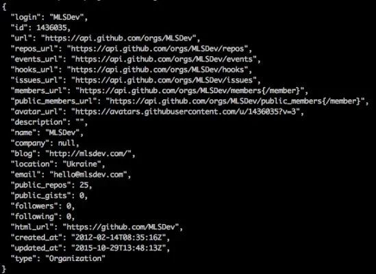
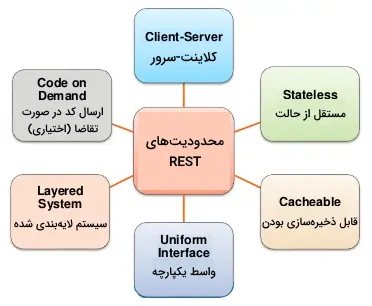

# چطور یک نرم افزار فروش طلا بزنیم؟

امروز با هم دیگه میخواییم بشینیم ببینیم اگه بخواییم یه نرم افزار ساده ی فروش طلا رو با هم بسازیم چه شکلی قراره باشه و چه ویژگی هایی میتونه مفید باشه براش.

بیایین اول ببینیم یک نرم افزار چه ویژگی هایی میتونه داشته باشه؟

ولی این خیلی سطح بالاست، بیایین با هم دیگه اول ببینیم انواع کد زدن چیه؟

## 1- انواع کد

ما در طول زندگی حرفه‌ای برنامه نویسیمون فقط کد نمیزنیم که کد زده باشیم و معمولا هرچیزی زده یا ساخته می‌شه برای یک هدف خاص هست، بعضی ها ممکنه به کوچیمی عملگر های جمع باشن و یا الگوریتم های ساده باشن یا نرم افزار های ساده یا حتی چیزای پیچیده تری که ممکنه یک سیستم عامل یا یک هوش مصنوعی یا اصلا گوگل باشه.

جدای از زبان و فریم‌ورکی که استفاده می‌کنیم، اصلا ماهیت این کدایی که با هم میزنیم فرق داره نه؟ درسته تو همش یه چیزی میگیم که ماشین بفهمه ولی خب اون سطح استفاده و ابزار های مورد نیازشون با هم خیلی فرق داره و تو هرکدوم باید خودمون به یک رویه ی درست برسیم تا بتونیم از پس تسک یا خواستمون به بهترین شیوه‌ی ممکن بر بیاییم و تا حد ممکن خواسته‌های مسئله رو هندلشون کنیم.

اما انواع این کد‌ها چیاست؟

### 1-1 کد‌های بی هدف

تو این نوع کد معمولا بدون هیچ هدف خاصی صرفا برای یاد گیری یا تمرین اصلا یه چیزی کلک بازی میاییم و یه سری کد رو بدون هیچ هدف خاصی پشت سر هم میذاریم و معمولا هم بعد یه مدتی دور انداخته می‌شن و اصلا ساختارمند نیستن و به درد هیچکس نمیخورن. معمولا آدما وقتی دنبال ایده میگردن یا میخوان یه چیزی رو تست کنن یا یه چیزی رو یاد بگیرن از این نوع کد‌ها استفاده میکنن.

### 1-2 کد‌های معمولی

یه سری کد مثل زدن بازی سنگ کاغذ قیچی یا ماشین حساب که معمولا باز هم در سطح خیلی جونیور هستند و یا یه چیزی رو میخوان یاد بگیرن هستند که معمولا داخل درس مبانی برنامه نویسی اغلب از این نوع کد‌ها استفاده می‌شه و در نهایت هم تو آینده ممکنه بشن بخشی از الگوریتم حل مسئله‌ی شما. در واقع باقی انواع کد از اینجا به بعد ترکیبی از این ها هستند و این کد‌های معمولی که میتونه شامل یه تابع فیبوناچی یا یه تابع مرتب سازی یا یه تابع محاسبه‌ی مساحت یا حجم یا یه تابعی برای محاسبه‌ی مسافت بین دو نقطه باشه میشن یه آجری برای استفاده تو یه پروژه‌ی بزرگ تر.

تو انواع این کد‌ها میشه به پیاده سازی الگوریتم های ساده و سورتینگ و یا پیاده سازی پروژه های کوچیک و ... اشاره کرد که معمولا کل فانکشنالیتی تو یک فایل هست و نیازی به جدا کردن نیست. فرق این کد های معمولی با اون کد های بی هدف اینه که این کد ها معمولا به شکل کلاس یا تابع زده میشن و در آینده به درد میخورن و اگه کد های شما امکان این رو ندارن که در جای دیگه ای استفاده بشن کد‌های بی هدف برده می‌شن و فاقد ارزشی جز ایده گرفتن و یا یادگیری هستند.

### 1-3 کد‌های پیشرفته

این کد ها همون کد های بالا هستند منتها فانکشنالیتیشون هدفمند تره و میدونیم ممکنه جای دیگه ای هم به شکل کپی پیست استفاده بشن ولی خیلی همچنان به درد بخور نیستند.

### 1-4 پکیج ها

به بخشی از این کد های پیشرفته که جوری زده می‌شن که باقی برنامه نویس ها بتونن به راحتی ازش استفاده کنند میگن پکیج. البته من این اسم رو تو ذهن خودم روش گذاشتم و ممکنه خیلی علمی نباشه ولی بازم خالی از لطف نیست دونستنش.

اقلب اوقات این کد ها یا پکیج ها بیلدینگ بلاک هایی هستند برای کد های آینده که خودشون از یه سری کد معمولی تشکیل شدن.

از این پکیج ها میتونید توی هر زبون برنامه نویسی به کرات پیدا کنین و معمولا اقلب ویژگی های مورد نظر ما تو دنیای برنامه نویسی تو همین پکیج ها پیاده و پیدا می‌شه و ما نیازی نیست خیلی چیزی خودمون رو از صفر پیاده کنیم. مثلا برای گرفتن دترمینان خب میتونی از یه بخشی از پکیج نامپای استفاده کنی. حالا تو اینجا نامپای پکیج هست و اون بخشی داخلش که به پیاده سازی کل روابط ریازی و اینترفیس‌هاش میپردازه یه کد پیشرفته هست و باز این بخش پیشرفته خودش از یه سری کد معمولی تشکیل شده.

معمولا پکیج ها خیلی کار ما رو راحت تر میکنن ولی یه نکته مهم درموردشون اینه که اگه از پکیجی زیاد استفاده میکنین حتما خودتون یه نگاه گذرایی به سورس کد هاش بندازین شاید خودتون بتونید بخشیش رو بهبود بدید و یا اصلا ازش ایده بگیرین. ولی حتما بخونید حتما بخونین چون خیلی مهم هست بدونین ابزاری که ازش استفاده می‌کنید چجوری کار می‌کنه.

### 1-5 نرم افزار

به یک سری کد و پکیج که به منظور هدف خاصی دور هم جمع شدن یک نرم افزار میگیم تو اینجا حالا چرا این رو از کد جدا می‌کنیم؟ چون اینجا جایی هست که تازه شما به عنوان یک توسعه دهنده پا رو وسط می‌ذارین. در واقع تو یک نرم افزار میلیون ها خط ممکنه استفاده بشه و کلی فانکشنالیتی مجزا که ما توانایی درک همشون رو نداریم یا اصلا اگر چنین مهارتی هم داشته باشیم وقت پیاده سازی همش رو نداریم برای همین یبار میشینیم کد های مورد نظرمون رو می‌نویسیم یه جا به شکل پکیج و یا از پکیج های بقیه استفاده می‌کنیم و یه نرم افزار رو پیاده می‌کنیم.

اگه حس میکنین چنین کاری نمی‌کنین خب یا خیلی گادین تو برنامه نویسی که به این درجه از عرفان رسیدید که می‌تونین همه چی رو از صفر خودتون پیاده سازی کنین که بسم الله ما به شما ایمان داریم در غیر این صورت اگر چنین کاری رو انجام نمی‌دید خب شما صرفا دارید قتتون رو تلف میکنین (البته اگر به دنبال یاد گیری نیستید من یاد گیری رو کلا جدا کردم از این بخش.)

## ویژگی‌های یک کد خوب برای نرم افزار

یک نرم افزار خوب و خوشگل یه سری ویژگی باید داشته باشه که اونا رو من تعیین نمی‌کنم بلکه شما و فرهنگ برنامه نویسی اون جایی که دارید توش کار می‌کنین مشخصش می‌کنید ولی به نظر من یه نرم افزار خوب تو یک شرایط مشخص (شرایط ها ممکنه با هم فرق کنه. مثلا شما وقتی وقت براتون مهم هست صرفا میزنید و خاسته مسئله رو میرسونین و اگه نیاز شد جایی رو تغییر میدید ولی اگه نیازی نباشه خب مشخصا تغییرش نمی‌دید ولی اگه وقت براتون مهم نیست خیلی و یا حس میکنین نیاز دارید در ادامه کدتون خیلی قراره بزرگ تر شه و یا تغییر کنه خب پس با ما همراه باشید با ادامه. ) باید یه سری داشته باشه. از نمونش اینه که درسته نیازی نیست میکروسرویس بزنین همیشه ولی سعی کنین حداقل تا حد ممکن توابع فایل ها و اپ هاتون رو از هم بشکونید.

یعنی چی؟ یعنی مثلا همش رو یه جا نزنین یا همش رو تو یک فانکشن نزنید. فانکشن ها باید هر کدوم برای کار جدایی باشند و هیچ فانکشنی نباید دو تا کار رو انجام بده. اینجوری هم کدتون خوانا تره و همم تغییر توش راحت تره و اگه جایی به مشکل بخوره نفر بعدی میتونه راحت اون رو تغییر بده. از طرف دیگه ای دیگه حذف یا اضافه کردن یه ویژگی جدید به نرم افزار خیلی دردسر نداره و می‌شه به راحتی اون رو انجام داد.

اما چجوری؟ بیاین یه مثال بزنیم

فرض کنین شما تو این افزار فروش طلاتون قراره طلا بفروشید و بخرید و هم یوزر اضافه کنین و هم بلاگ داشته باشین و هم ماشین حساب و بخش خبر و ایمیل و کلی چیز دیگه خب الان اگه بخوایی این رو پیاده سازی کنی تو یه فایل و همش تو یه فانکشن باشه پدرت در میاد در آینده برای این که بخوایی یه ویژگی بهش اضافه کنی و همینطور کلی دیباگش سخته و اصلا قشنگ نیست. این نمونه بارز نداشتن تفکر دولوپر بودنه و این یعنی شما تو کد نویس بودن گیر کردید. دقت کنین که کد نویس بودن خیلییی چیزی خوبی هست ولی خب شما الان دارید یک نرم افزار توسعه می‌دید و هر جایی فرهنگ مناسب خودش رو میطلبه و اگه شما مثل یک کد نویسی به قضیه فکر کنین صرفا دهن باقی دولوپر ها و همچنین آینده ی اون پروژه رو به فنا میدید و کدتون صرفا یک کد یک بار مصرف میشه که قرار نیست هیچ وقت تغییر خاصی بکنه. حواستون همیشه باید باشه که چه کاری دارید انجام می‌دید. اگه کد میزنین خب کد بزنین ولی اگه دارید نرم افزار توسعه می‌دید باید تا حد ممکن به فکر آینده‌ی پروژه باشید (البته زیاده روی نکنین.) و بدونین چجوری می‌شه اون رو از هم شکوند. یه سری چیز هست که من تو این مدت بهشون رسیدم در این مورد.

- از کلاس ها و توابع زیاد استفاده کنین و کد هاتون رو بشکونید.
- توابع رو با هم قاطی نکنین و زنچیره وار ازشون استفاده نکنین. سعی کنین یه تابع رابط داشته باشید برای صدا زدن مثلا این مورد رو نگاه کنین.

  ```python
  import random

  users = {
      1: {
          "id": 1,
          "name": "ali",
          "last_name": "alavi"
      },
      2: {
          "id": 2,
          "name": "reza",
          "last_name": "rezai"
      }
  }

  def get_user():
      return random.randint(0, len(users) - 1)

  def get_username(user_id):
      return users[user_id]["name"]

  def main():
      user_id = get_user()
      print(get_username(user_id))
  ```

  شما الان می‌تونستید خیلی راحت `get_user` رو داخل تابع `get_username` صدا بزنین ولی خب ممکنه یه جا یکی بخواد یه یوزر خاص رو بگیره بجای این که یوزر رندوم بگیره.
  خیلی چیز زیادی اضافه نمی‌کنه به کدتون ولی خب می‌تونین از هر دو تابع هر جایی دوست دارید استفده کنین و صرفا دیپندنسی هاشون رو کمتر کردید و روابط رو خودتون مدیریت می‌کنین. حالا این مثال واضع و مسخره بود ولی تو پروژه های بزرگ تر خیلی چنین مواردی پیش میاد که میاییم زنجیره وار از توابع استفاده می‌کنیم در صورتی که می‌شه هرکدوم رو نوشت و  بعد تو یه تابع دیگه اون فلو رو کنترل کرد تا جربان زیر دستمون باشه و از طرفی شخص با خوندن همچون چند خط کد کل پروژه دستش میاد و کار راحت تره. حالا اصلا اگه بخوام یکی از توابع رو تغییر هم بدم خیلی فرقی نمی‌کنه تو پروژه و اینجوری نگه داریش راحت تر می‌شه.

- سعی کنین هارد کد نکنین. هارد کد کردن یعنی نابود کردن پروژه سعی کنین همیشه تو یه بخش کانفیگی چیزی کل مقدار های اساسی رو نگه دارید و به هیچ وجه هارد کد نکنین چیزی رو . اصلا مثلا شاید تو مورد بالا به نظر نیاد ولی اونجا هم هارد کد داره. چحوری درستش کنیم؟ نمونه اولش تابع `get_user` هست که به وضوح هارد کده. بهتر نبود می‌نوشتیم:

  ```python
    def get_user(start = 0, end = None):
        if end is None:
            end = len(users) - 1
        return random.randint(start, end)
  ```

  اینجوری شخص می‌تونه بازه یوزر هاش رو تغییر بده بدون این که تغییری در اصل موضوع پیش بیاد.
  یا مثلا برای تابع پایینش نمی‌شد اینجوریش کرد؟

  ```python
    def get(user_id, key = "name"):
        return users[user_id][key]
  ```

  اینجوری شاید شخص دلش یک چیز دیگه رو بخواد و ما بدون تغییر در اصل موضوع تونستیم این کار رو انجام بدیم و دیگه نیازی به پیاده سازی تابع جدید نیست. از طرفی تابعمون دو کار رو انجام نمیده بلکه صرفا اون بخشی رو که بخواییم از یه یوزر بهمون می‌ده و این باعث می‌شه کدمون طولانی نشه و خودش رو تکرار نکنه. پیدا کردن چنین مواردی و سعی به درست کردنشون یکی از مواردی هست که باعث میشه کد خیلی حجمش کمتر بشه و دیگه پیچیدگی بیش از حد نداشته باشه. معمولا وقتی دارین کد می‌زنین بعد این که تسکتون یا اون بخش از تسکتون تموم شد برگردید ببینید چنین مواردی رو به کرات مشاهده می‌کنین و اگه یکم وقت بذارید و مرتبش کنین و موارد اضافی رو حذف کنین حجم کدتون یک سوم می‌شه و دیگه نیازی نیست که همیشه به کدتون نگاه کنید و ببینید چیزی تکرار شده یا نه.
  همم این که می‌تونین از اون بخش تو جاهای دیگه هم استفاده کنین و نسبتا خیلی مرتب تر می‌شه. حالا باقی چیزا رو هم بر اساس همین می‌تونید بنویسید.
  
- کارایی تابعتون رو مشخص کنین. یه راه سادش استفاده از کامنت هاست و یا حالا تو اکثر زبون‌های خاص استفاده از داک استرینگ ها کار رو خیلی راحت می‌کنه. دیگه حتی کسی که بعد شما میاد یا اصلا خودتون نیازی نیست کد ها رو بخونین و این کار رو خیلی راحت تر می‌کنه.
  
  ```python
  def get_user(start=0, end=None):
      """
      Returns a random user ID within the specified range.

      Parameters:
      start (int): The starting index of the range (inclusive). Default is 0.
      end (int, optional): The ending index of the range (inclusive). Default is None, which means the last index of the users list.

      Returns:
      int: A random user ID within the specified range.
      """
      if end is None:
          end = len(users) - 1
      return random.randint(start, end)


  def get(user_id, key="name"):
      """
      Retrieve a specific attribute of a user.

      Args:
          user_id (int): The ID of the user.
          key (str, optional): The attribute to retrieve. Defaults to "name".

      Returns:
          The value of the specified attribute for the user.

      Raises:
          KeyError: If the user ID is not found in the users dictionary.
      """
      return users[user_id][key]
  ```

  - درسته که این متن ها خیلی طولانی شدند ولی تو اکثر مواقع کلاس ها و توابع خیلی بزرگتر و پیچیده هستن و چنین متن هایی هرچند یکم شلوغ کنند کد رو ولی به شدت به درک بهتر کد کمک می‌کنین و این که همیشه آپدیت باشن باعث میشه سرعت توسعه‌ی نفر بعدی و یا حتی خودتون در آینده به کرات زیاد شه و دیگه مشکل خاصی برای فهم نداشته باشید. نکته مهم واضح بودن متن هست. مثلا نوع ورودی ها و همینطور تایپشون و همینوطر نوع خروجی و تایپش و کاربردش و همینطور انواع خطا هایی که ممکنه رخ بدن رو بگید خیلی می‌تونه کمک کنه در هندل کردنشون.

- مشخص کردن کامل نوع ورودی و نوع خروجی: حالا درسته که ما تو متن داک استرینگ مشخص کردیم ولی مشخص بودنش تو کد هایی مثل پایتون و جاوا اسکریپت باعث کاهش ۸۰ درصدی خطاهای موقع پروداکشن می‌شه و بهتره که این مورد رو حتما مد نظر داشته باشید. مثلا به طور خلاصه در کد بالا

  ```python
  import random
  from typing import Dict, Optional

  users: Dict[int, Dict[str, str]] = {
      1: {"id": 1, "name": "ali", "last_name": "alavi"},
      2: {"id": 2, "name": "reza", "last_name": "rezai"},
  }


  def get_user(start: int = 0, end: Optional[int] = None) -> int:
      """
      Returns a random user ID within the specified range.

      Parameters:
      start (int): The starting index of the range (inclusive). Default is 0.
      end (int, optional): The ending index of the range (inclusive). Default is None, which means the last index of the users list.

      Returns:
      int: A random user ID within the specified range.
      """
      if end is None:
          end = len(users) - 1
      return random.randint(start, end)


  def get(user_id: int, key: str = "name") -> str:
      """
      Retrieve a specific attribute of a user.

      Args:
          user_id (int): The ID of the user.
          key (str, optional): The attribute to retrieve. Defaults to "name".

      Returns:
          The value of the specified attribute for the user.

      Raises:
          KeyError: If the user ID is not found in the users dictionary.
      """
      return users[user_id][key]
  ```

  حالا این تایپ‌هایی که من دادم از نظر تایپ چکینگی خیلی دقیق نیستند ولی خب برای من تا حد خوبی کار رو راه می‌ندازه و می‌تونم با دقت به نوع ورودی و خروجی حجم عظیمی از خطا ها رو کاهش بدم.
  به قول معروف هرچقدر تو دولوپ بیشتر خطا بگیری تو پروداکشن کمتر به خطا می‌خوری.  

بازم اگه چیزی یادم اومد اضافه می‌کنم ولی فعلا بریم سراغ ادامه‌ی راه.

## ویژگی‌های مفهومی یک نرم افزار

نرم افزار‌ها بسته به این که قراره به کی سرویس بدن ممکنه به شیوه‌های مختلفی نوشته بشن. ولی به طور مفهمونی اکثرشون رو می‌شه به دو تا بخش `Back-End` و `Front-End` تقسیم کرد.
حالا بازم میگم لزومی نداره که مثلا فرانت اند همیشه  جاوا اسکریپت باشه یا اصلا جدا باشه فرانت اند صرفا یک مفهوم هست و اون اشاراه داره به کاربری که داره از اون استفاده می‌کنه.

مثلا داحل یک دیتابیس وقتی میریم یه چیزی رو سلکت می‌کنیم اون دیتابیس منیجر برامون اون عملیات رو انجام میده و نتیجه رو به ما می‌ده و تو اینجا پشت کار می‌شه بک اند که ما نمی‌بینیم و اون کوئری سلکتی که میزنیم می‌شه فرانت اند کار. حالا ما میاییم یه تابع می‌نویسیم مثلا با سی یا پایتون که بیاد و یه کار خاصی رو برامون رو اون دیتا انجام بده تو اینجا کل اون بخش دیتابیس و اون کده می‌شه بک اند و اون استفاده از تابع می‌شه فرانت اند و کلا بک اند چیزی هست که ما نمی‌بینیم و بازم تاکید می‌کنم که بک اند های فراوانی تو یک پروژه هست و ما همیشه مجموعه‌ی بزرگترینش رو به عنوان بک‌اند یک پروژه می‌بینیم. در واقع بازم حس می‌کنم شاید استفاده از دو تا کلمه بک اند و فرانت اند تا حدی گیج کننده باشه و ما بهتره اونا رو به ارائه دهنده و مشتری تقسیم کنیم.

هرچیزی رو که مشتری میبینه می‌گیم `Client` و هرچیزی که این کلاینت تو پشت کار باهاش ارتباطه و مجموعه زنجیر های پشت کار رو کلا `Server` می‌نامیم از اینجا به بعد و کلمات بک اند و فرانت اند رو هم صرفا الایس های برای این مفاهیم می‌بینیم ولاغیر.

پس تمام پروژه ها بلا استثنا یک کلاینت دارن و یک سرور منتها شاید اون بخش کلاینت یا سروره خیلی برامون قابل لمس نباشه ولی همیشه هست و میشه به شکل زیبایی دیدش.

حالا بعد از این توضیحات نسبتا طولانی بریم سراغ یک سری ویژگی مهم از هر نرم افزار.

### پیاز باشید

استفاده لایه لایه از کد ها جوری که بشه تو هر مرحله به راحتی کلاینت و سرور رو تشخیص داد خیلی مهمه. نباید با هم قاطی کنین مفاهیم رو چون بعدا خیلی راحت باعث در هم تنیدگی کدتون می‌شه و پدرتون رو در میاره. نمونه‌اش هم اینه که بیایین کد های مرتبط با دیتابیس رو مستقیم تو دل کدتون استفاده کنین یا پاسخ دادن به کاربر رو مستقیم بذارین تو دل کدتون که این باعث میشه خاصیت پیاز بودن و لایه لایه بودن رو از دست بدید و اگر در جایی کدتون به مشکلی بخوره دیگه خدا هم نمی‌تونه به دادتون برسه از طرفی کلی از ویژگی ها رو باید مدام بنویسید و کدتون اصلا خوانا نیست و اگه بخواید یه نفر دیگه بخونه باید یه مدت زیادی وقت بذاره تا بفهمه چی می‌گید همم مشکل تکرار کد رو داره (اصطلاحا `DRY` یا `Don't Repeat Yourself` تیست)

مثلا برای یک برنامه‌ی وب اکثرا مدل `MVC` رو پیشنهاد می‌دن که اینجوریه که کل کد های دیتابیستون برای ساختن یک مدل رو یه جا می‌نویسید. فانکشن های اصلیتون رو که از اون مدل ها استفاده می‌کنن تو یک فایل دیگه و کل کارهایی که برای کاربر قابل مشاهده هستند که حالا اصلا میتونه  `HTML` باشه یا `QT` باشه یا `Android` یا هر چرتی تو یک فایل دیگه. اینجوری کدتون خوانا می‌شه و اگه بخوایین هم اندروید داشته باشید هم `QT` اون فانکشن هایی که داخل کنترولر هستند ثابت می‌مونن و فقط بخش ویوی کار رو خیلی ساده شخصی سازی می‌کنین و بوم! همش مثل هم کار می‌کنه و نیازی نیست بک اند رو دوباره بنویسید ولی اگر در هم تنیده بنویسید برای هر کلاینت جدید مجبورید باز و باز و باز کد ها رو بنویسید و یه جا یکی به مشکل بخوره به سختی باید کل جاهایی که از اون کد استفاده شده رو پیدا کنین و تغییر بدید. :\( متاسفم... شما به یه جایی رفتید.

البته من خودم ساختار کد هام فرق داره
به طور دقیق تر بخوام بگم یه همچین چیزی هست تو هر پروژه

```bash
.
├── gold
│   ├── __init__.py
│   ├── controllers.py
│   ├── models.py
│   ├── serializers.py
│   ├── tests.py
│   ├── urls.py
│   ├── utils.py
│   └── views.py
├── payment
│   ├── __init__.py
│   ├── controllers.py
│   ├── models.py
│   ├── serializers.py
│   ├── tests.py
│   ├── urls.py
│   ├── utils.py
│   └── views.py
└── users
    ├── __init__.py
    ├── controllers.py
    ├── models.py
    ├── serializers.py
    ├── tests.py
    ├── urls.py
    ├── utils.py
    └── views.py
```

توضیحات:

اولا بگم که اپ ها رو با توجه به مفهومشون می‌شکونیم تا بعدا بتونیم به شکل مجزا با هرکدوم کار کنیم.

- models.py
  - این فایل برای کار با دیتابیس هست مثلا می‌تونه شامل کلاس های `ORM` باشه یا اصلا خودمون بنویسیم. معمولا کوئری ها رو اینجا نمی‌نویسن و صرفا شمای کار رو اینجا می‌تونین ببینید.
  مثلا تو جنگو یک کلاس می‌سازن مثل این

  ```python
  from django.db import models


  class Goods(models.Model):
      """
      Represents a goods item.

      Attributes:
          id (int): The unique identifier for the goods item.
          name (str): The name of the goods item.
          description (str): The description of the goods item.
          price (float): The price of the goods item.
          created_at (datetime): The date and time when the goods item was created.
          updated_at (datetime): The date and time when the goods item was last updated.
      """
      id = models.AutoField(primary_key=True)
      name = models.CharField(max_length=100)
      description = models.TextField()
      price = models.FloatField()
      created_at = models.DateTimeField(auto_now_add=True)
      updated_at = models.DateTimeField(auto_now=True)
  ```

  چیز خاصی نیست و کل مدل هامون همینه. نیازی نیست نگران تعداد فایل ها باشید. یک استراکچر کلی و ساده می‌تونه خیلی از مشکلات رو حل کنه.

- controllers.py
  - این فایل برای کنترل کردن کار هایی هست که مربوط به مدل ها هستند. مثلا اگر بخوایم یک کاربر رو اضافه کنیم یا یک کاربر رو پاک کنیم اینجا انجام می‌شه. معمولا کوئری ها رو اینجا می‌نویسند و اصلا کاری با دیتابیس ندارند. البته تو جنگو انجام دادن همچین کاری زیاد با فرهنگ کمیونیتی جور نیست ولی خب کار قشنگیه.
  البته بازم میگم خیلی جاها تو کد چیزای خیلی مهم تری نسبت به این مواردی که من نوشتم نیازتون می‌شه مثلا تهیه ی یک گزارش از یه سری کاربر که تقلب ردند و تبدیل کردن اون به یک چیز دیگه ای و کلی چیز دیگه ولی خب اینا بیسیک ترین مواردی هست که می‌شه پیاده سازی کرد. بازم عذر می‌خوام که زیبا نیستند.

  ```python
  from gold.models import Goods


  def add_goods(name: str, description: str, price: float) -> Goods:
      """
      Adds a new goods item to the database.

      Args:
          name (str): The name of the goods item.
          description (str): The description of the goods item.
          price (float): The price of the goods item.

      Returns:
          Goods: The newly created goods item.
      """
      goods = Goods(name=name, description=description, price=price)
      goods.save()
      return goods


  def get_goods(goods_id: int) -> Goods:
      """
      Retrieves a goods item from the database.

      Args:
          goods_id (int): The ID of the goods item to retrieve.

      Returns:
          Goods: The goods item with the specified ID.

      Raises:
          Goods.DoesNotExist: If the goods item with the specified ID does not exist.
      """
      return Goods.objects.get(id=goods_id)


  def get_all_goods() -> list[Goods]:
      """
      Retrieves all goods items from the database.

      Returns:
          list[Goods]: A list of all goods items in the database.
      """
      return list(Goods.objects.all())


  def update_goods(goods_id: int, name: str, description: str, price: float) -> Goods:
      """
      Updates the details of a goods item in the database.

      Args:
          goods_id (int): The ID of the goods item to update.
          name (str): The new name of the goods item.
          description (str): The new description of the goods item.
          price (float): The new price of the goods item.

      Returns:
          Goods: The updated goods item.

      Raises:
          Goods.DoesNotExist: If the goods item with the specified ID does not exist.
      """
      goods = Goods.objects.get(id=goods_id)
      goods.name = name
      goods.description = description
      goods.price = price
      goods.save()
      return goods


  def delete_goods(goods_id: int) -> None:
      """
      Deletes a goods item from the database.

      Args:
          goods_id (int): The ID of the goods item to delete.

      Raises:
          Goods.DoesNotExist: If the goods item with the specified ID does not exist.
      """
      goods = Goods.objects.get(id=goods_id)
      goods.delete()


  def search_goods(query: str) -> list[Goods]:
      """
      Searches for goods items in the database based on a query string.

      Args:
          query (str): The search query.

      Returns:
          list[Goods]: A list of goods items that match the search query.
      """
      return list(Goods.objects.filter(name__icontains=query))
  ```

  البته این تو جنگو هست و تو جاهای مختلف فرق می‌کنه.
  
- serializers.py
  - کار این فایل اینه که اطلاعاتی که از دیتابیس می‌خوایم رو به یک فرمت خاص تبدیل کنیم. مثلا اگر بخوایم اطلاعات یک کاربر رو به یک فرمت خاص برای ارسال به کلاینت تبدیل کنیم اینجا انجام می‌شه. معمولا این فرمت `JSON` هست ولی می‌تونه هر چیز دیگه ای هم باشه. کلا خیلی کار سختی نداره.
  حالا اگه از رست فریم‌ورک استفاده کنی کل کار تقریبا همین می‌شه.

  ```python
  from rest_framework import serializers

  from gold.models import Goods


  class GoodsSerializer(serializers.ModelSerializer):
      """
      A serializer for the Goods model.
      """

      class Meta:
          model = Goods
          fields = "__all__"

  ```

  و اگه بخوایی دستی بزنی باید ده بیست تا از این توابع رو پیاده سازی کنی:

  ```python
  from typing import Any, Dict

  from gold.models import Goods


  def custom_good_serializer(good: Goods) -> Dict[str, Any]:
      """
      A custom serializer for the Goods model.

      Args:
          good (Goods): The goods item to serialize.

      Returns:
          dict: A dictionary representation of the goods item.
      """
      return {
          "id": good.id,
          "name": good.name,
          "description": good.description,
          "price": good.price,
          "created_at": good.created_at,
          "updated_at": good.updated_at,
      }


  def custom_goods_serializer(goods: list[Goods]) -> list[Dict[str, Any]]:
      """
      A custom serializer for a list of Goods objects.

      Args:
          goods (list[Goods]): A list of goods items to serialize.

      Returns:
          list[dict]: A list of dictionary representations of the goods items.
      """
      return [custom_good_serializer(good) for good in goods]
  ```

- views.py
  - ویو ها معمولا تو جاهای متفاوتی رو شامل می‌شن که تو این ساختار پیشنهادی من می‌تونین خیلی راحت چه به شکل مستقیم چه با استفاده از `REST-API` چه مفاهیم دیگه خیلی راحت موارد رو پیاده سازی کنین چون شما صرفا مواردی مثل احراز هویت و همچنین دریافت خواسته‌ها و تعامل با کاربر رو در اینجا دارین و این باعث می‌شه خیلی راحت و بدون نیاز به نوشتن کد های تکراری تو هر پلتفرمی که نیاز داشتید سرویس ارائه بدید و لذت ببرید و این واقعا زیباست که نیازی به دوباره کاری نیست. از طرفی بازم میگم اگه جایی مشکلی داشته باشین خیلی راحت می‌تونین اون مشکل رو پیدا کنین و حل کنین.

- tests.py
  - تست یکی از مهم ترین بخش های برنامه نویسی هست و تو خیلی از الگو ها اصلا اول تست رو مینویسن بعد میرن سراغ نوشتن تسکشون چون تو باید خروجیت از هر مرحله و موارد مورد انتظارت مشخص باشه. اط طرفی ممکنه یه تکه‌ای به کدت اضافه کنی که گند بزنه به باقی کدا و باعث خطا هایی بشه که خودت نمیدونی برای همین صرفا برای هر api تست می‌نویسی و میگی که انتظارت چیه مثلا من انتظار دارم فلان صفحه باز شه یا با خواستن اطلاعات فلان کابر بهم ارور 401 بده چون من احراز هویت نشدم و نباید اطلاعات رو بهم نشون بده یا اصلا من گوگلم و یه بدبختی تو ایران میخواد یه کاری کنه باید سریع بهش 403 نشون بدم خب اگه اینا رو تو تستا ننویسیم ممکنه یه جایی تو یکی از سرویس ها اشتباهی به ایرانیای بدخبت سرویس بدیم و این باعث بروز کلی مشکلات ممکنه بشه و احتمالا اگه هندلش نکنیم علاوه بر اون مشکلاتی که گفتم ممکنه که اشخاص از این طریق بخوان به ما آسیب بزنن. خلاصه حواست به تستا باشه و حتما `unit test` رو یاد بگیر.
- urls.py
  - برای من این فایل شامل روت های برنامم هست. یه جورایی مشخص میکنم اگه یوزر داخل مرورگر فلان آدرس رو زد بره تو کدوم قسمت از برنامم کدوم قسمت از ویون رو اجرا کنه و این باعث میشه که کنترل خبی روی یو آر ال ها داشته باشم و بتونم همش رو یه جا ببینم.
- utils.py
  - این فایل برای من مسئول کد های مشترکی هست که معمولا زیاد استفاده می‌کنم و بخشی از فانکشنالیتی اصلی کد هام نیستن مثلا تبدیل کردن اعداد انگلسیی به فارسی یا حذف فاصله های اضافه یا مرتب کردن لینک اینستا و ... خب چیزی نیستن که آوردنشون تو کنترولر ضرروی باشه و بیشتر باعث تلف شدن وقت خواننده می‌شه برای همین باید سعی کرد این موارد کوچیک رو برد یه جا تا هم بشه همه جا استفاده کرد و هم تایم نگیرن.

حالا که با هم یه نگاهی به ساختار پروژه انداختیم بیا یکم وارد فرانت اند شیم.

#### فرانت اند

فرانت اند به یا همون کلاینتی که بار ها گفتم وظیفش ارتباط با سرویس مبدا هست که می‌تونه یک شخص باشه یا یک نرم افزار یا هرچیزی و ما به طور کلی به این میگیم فرانت اند یا کلاینت.
کلاینت معمولا از خودش بار پردازشی خاصی نداره و بهتره که نداشته باشه هم خیلی و صرفا بهتره نمایش دهنده دیتا باشه و دستورات رو از کاربر دریافت کنه و به بک اند منتقل کنه. البته این وسط یه سری مرتب سازی ها ر هم اروی دستورات ممکنه انجام بده ولی مهم نیست. مثلا تو اون نرم افزار فروشگاهی تحت ترمینال کار اون ورودی گرفتنه صرفا گرفتن رودی بود و بعد میداد به توابع دیگری که تو اینجا اون ترمینال با اون متن هایی که کاربر میدید یا اون متن هایی که وارد می‌کرد می‌شد فرانت اند و اون بخش پردازشیش می‌شد بک اند یا مثلا تو سایت ها این چیزی که میبینی فرانت اندش هست و اون دیتایی که میفرسته سمت بک اند هست. اما صبر کن این وسط یه مشکلی پیش میاد... فرانت اند و بک اند توی وبسایت با هم چجوری ارتباط گرفتن؟

خب جواب دادن به این سوال تازه ما رو میرسونه به سوال اصلی تو یعنی API... به طور کلی API یا Application Programming Interface همینکار رو برامون می‌کنه. مهم نیست تو وب یا تو کامند لاین یا اصلا بین پکیج‌ها... مهم اینه هر کد رو میشه مثل یه تابع دید که یه سری ورودی مشخص و یه سری خروجی مشخص داره. البته اینم بگم که ورودی مشخص و خروجی مشخص بیشتر شماش مد نظر هست مثلا اسم میگیره فامیلی میده دیگه برامون مهم نیست چه اسمی.
از این api ها میشه تو همه جا استفاده کرد و انگار زبون مشترک بین اون توابع هست و کلا میشه به چشم یه گارسون دید که درخواست ها رو از مشتری میگیره میبره به آشپزخونه و غذا رو از آشپز میگیره و میده به مشتری و اینجوری ارتباط بین بک اند و فرانت اند رو برقرار می‌کنه. بازم میگم لزومی نداره در بستر وب باشه و میتونه همه جا باشه همون طور که واقعا همه جا هست و صرفا یک مفهوم انتزاعی هست از یک تابع با ورودی و خروجی مشخص.

البته که این API ها می‌تونن در بستر وب منتقل شن ولی این موضوع اصلا مهم نیست و می‌تونن از طریق هر چیزی منتقل بشن. مثلا از طریق `HTTP` یا `TCP` یا `UDP` یا `MQTT` یا `Websocket` یا `gRPC` یا `GraphQL` یا `SOAP` یا `REST` یا `JSON-RPC` یا `XML-RPC` یا `CORBA` یا `RMI` یا `D-Bus` یا `COM` یا `DCOM` یا `RPC` یا `RMI` یا `EJB` یا `JMS` یا `JMX` یا `JNDI` یا `JDBC` یا `JPA` یا `JTA` یا `JCA` یا `JTA` یا `JCA‍` یا اصلا روی یه فایل یا هرچیز دیگه ای...
البته اینا رو اگه نمی‌دونی میتونی سرچ کنی اکثرا پروتکل های وبن ولی خیلی چیزای دگه هم می‌تونن باشن مثلا میگم روی مموری منتقل شه این درخواست.

پس دیدیم که API خودش چیزی نیست بلکه یک مفهومه که بهت میگه فلان تابع رو با فلان تایپ از ورودی ها کال کن من بهت فلان خورجی ها رو میدم. اما چیزی که اینجا مد نظر ماست API های بر بستر وب هستند که یکم ساختار مند ترند. یعنی چی؟ یعنی یه سری اصول دارن چون  API هرچیزی میتونه بفرسته و بگه ولی اگه یکم قانون بذاریم روش و یکم تغییرش بدیم می‌شه یکی از مهم ترین ارکان دنیای امروز یعنی REST API اما رست چی هست؟
در واقع رست همون API خودمون هست با چهار تا قانون توش:

چون من خیلی یادم نیست بذار این بخش رو از فرادرس کپی کنیم و عینا بذاریم همینجا:

- API چیست ؟
API‌ سرنامی برای «واسط برنامه‌نویسی اپلیکیشن» (Application Programming Interface) است. API یک میانجی یا واسطه است که امکان برقراری ارتباط میان دو برنامه کاربردی را فراهم می‌کند.

- HTTP چیست ؟
HTTTP‌ سرنامی برای «پروتکل انتقال فرا متن» (Hypertext Transfer Protocol) است. HTTP پروتکل یا ضوابطی است که برای انتقال داده در وب استفاده می‌شود.
ما تو دیتابیس برای هر تیبلی چهار تا کاربرد اصلی برای سر و کار داشتن با خود دیتا و یدونه هم سرچ لازم داریم

- کلاینت چیست ؟
کلاینت (مشتری | Client) شخص یا نرم‌افزاری است که از API استفاده می‌کند. کلاینت می‌تواند یک توسعه‌دهنده باشد. برای مثال، یک شخص به عنوان توسعه‌دهنده می‌تواند در برنامه‌ای که می‌نویسد API توییتر را برای خواندن و نوشتن داده‌ها از توییتر، ایجاد یک توییت جدید و کارهای بیش‌تر به کار گیرد.

- منبع چیست ؟
یک منبع (Resource) می‌تواند هر شیئی باشد که API امکان فراهم‌سازی اطلاعاتی را در موردش داشته باشد. به عنوان مثال در API اینستاگرام، منبع می‌تواند یک کاربر، یک عکس یا یک هشتگ باشد. هر منبع دارای یک شناسه منحصربه‌فرد (Unique Identifier) است. شناسه می‌تواند یک نام یا یک عدد باشد.




پاسخ سرور در REST چگونه است ؟
وقتی کلاینت یکی از APIهای خود را فراخوانی می‌کند،‌ آنچه که سرور انجام می‌دهد به دو چیز وابسته است که باید توسط کلاینت فراهم شود. این دو مورد، در ادامه فهرست شده‌اند.

یک شناسه (Identifier) برای منبع مورد نظر نیاز است. این شناسه، همان URL منبع مربوطه است که همچنین، به عنوان نقطه انتهایی (Endpoint) نیز شناخته می‌شود. در واقع، URL‌ سرنامی برای Uniform Resource Locator به معنای «موقعیت‌یاب یکپارچه منبع» است.
عملیاتی که سرور باید روی آن منبع انجام دهد. این عملیات می‌تواند در قالب یک متُد HTTP یا یک فعل (Verb) باشد. از متدهای رایج HTTP می‌توان PUT ،POST ،GET و DELETE را نام برد.
برای مثال، واکشی یک کاربر توییتر خاص، با استفاده از RESTful API توییتر، به یک URL نیاز خواهد داشت که آن کاربر و متد اچ‌تی‌تی‌پی GET را شناسایی کند. از متد GET‌ برای واکشی منابع استفاده می‌شود.

یک مثال برای درک بهتر
«www.twitter.com/jk_rowling» یک URL است که شناسه منحصربه‌فرد جی.کی. رولینگ (J. K. Rowling) در توییتر را به همراه دارد که همان شناسه‌کاربری (Username) او (jk_rowling) است. توییتر از شناسه‌کاربری به عنوان Identifier استفاده می‌کند و البته شناسه‌های کاربری توییتر منحصربه‌فرد هستند و هیچ دو کاربر توییتر با شناسه‌کاربری یکسان وجود ندارد. متد اچ‌تی‌تی‌پی GET تعیین می‌کند که قصد دریافت حالت آن کاربر وجود دارد.


حالا البته هر کدوم از اینا نیاز به توضیحات خیلی زیادی دارن که الان یه مقداری خسته ام چون یکی دو ساعت دیگه باید برم سر کار و هنوز نخوابیدم ولی کامل برات توضیح می‌دم. برای بخش API دیزایین بیشتر تجربی می‌طلبه.

بذار اول یه سری مفاهیم دیگه رو هم در مورد رست مثل کد خطا ها و ... بگیم بعد بریم سراغ API دیزاین

### جدول کد خطاها در REST API

پیشنهاد می‌کنم که ۵ تای اول رنج‌های 200, 400, 500 و همچنین ۲ تای اول کد 300 رو حفظ کنی باقی خیلی کاربردی ندارن ولی می‌تونی ببینیشون و یاد بگیری.

| کد خطا | عنوان خطا                       | توضیحات                                                                               |
| ------ | ------------------------------- | ------------------------------------------------------------------------------------- |
| 100    | Continue                        | سرور درخواست اولیه را دریافت کرده و کلاینت باید ادامه درخواست را ارسال کند.           |
| 101    | Switching Protocols             | سرور درخواست کلاینت برای تغییر پروتکل‌ها را پذیرفته است.                               |
| 102    | Processing                      | سرور در حال پردازش درخواست است و هنوز پاسخی ندارد.                                    |
| 103    | Early Hints                     | سرور پیشنهادات اولیه برای سرور پروکسی برای بهینه‌سازی بارگذاری را ارسال می‌کند.         |
| 200    | OK                              | درخواست موفقیت‌آمیز بوده است.                                                          |
| 201    | Created                         | منبع جدید با موفقیت ایجاد شده است.                                                    |
| 202    | Accepted                        | درخواست پذیرفته شده است، اما هنوز پردازش نشده است.                                    |
| 203    | Non-Authoritative Information   | پاسخ موفقیت‌آمیز بود ولی اطلاعات از منبع غیر معتبر بدست آمده است.                      |
| 204    | No Content                      | هیچ محتوایی برای ارسال در پاسخ وجود ندارد.                                            |
| 205    | Reset Content                   | درخواست موفقیت‌آمیز بوده و کاربر باید نمای صفحه را ریست کند.                           |
| 206    | Partial Content                 | فقط بخشی از منبع ارسال شده است.                                                       |
| 207    | Multi-Status                    | بدنه پیام حاوی وضعیت‌های مختلف مربوط به درخواست‌های چندگانه است.                        |
| 208    | Already Reported                | اعضای وابسته قبلاً گزارش شده‌اند.                                                       |
| 226    | IM Used                         | سرور اجرای موفقیت‌آمیز یک درخواست GET را بر اساس یک تبادل پیشین گزارش می‌دهد.           |
| 300    | Multiple Choices                | درخواست دارای چندین پاسخ ممکن است.                                                    |
| 301    | Moved Permanently               | منبع درخواست شده به یک URI جدید منتقل شده است.                                        |
| 302    | Found                           | منبع درخواست شده به طور موقت در یک URI متفاوت است.                                    |
| 303    | See Other                       | پاسخ می‌تواند در یک URI دیگر یافت شود با استفاده از روش GET.                           |
| 304    | Not Modified                    | منبع از آخرین درخواست تغییر نکرده است.                                                |
| 305    | Use Proxy                       | درخواست باید از یک پروکسی استفاده کند.                                                |
| 307    | Temporary Redirect              | منبع درخواست شده به طور موقت به URI جدید منتقل شده است.                               |
| 308    | Permanent Redirect              | منبع درخواست شده به طور دائم به URI جدید منتقل شده است.                               |
| 400    | Bad Request                     | سرور نمی‌تواند به دلیل خطای کلاینت، درخواست را پردازش کند.                             |
| 401    | Unauthorized                    | برای دریافت پاسخ نیاز به احراز هویت است.                                              |
| 402    | Payment Required                | این کد برای استفاده در آینده رزرو شده است.                                            |
| 403    | Forbidden                       | سرور از انجام درخواست امتناع می‌ورزد.                                                  |
| 404    | Not Found                       | منبع درخواست شده در سرور یافت نشد.                                                    |
| 405    | Method Not Allowed              | روش استفاده شده برای درخواست به منبع معتبر نیست.                                      |
| 406    | Not Acceptable                  | منبع بر اساس سربرگ‌های درخواست، قابل پذیرش نیست.                                       |
| 407    | Proxy Authentication Required   | کلاینت باید ابتدا خود را به پروکسی احراز هویت کند.                                    |
| 408    | Request Timeout                 | سرور منتظر درخواست کلاینت بوده و زمان آن به پایان رسیده است.                          |
| 409    | Conflict                        | درخواست با وضعیت کنونی سرور در تضاد است.                                              |
| 410    | Gone                            | منبع درخواست شده دیگر در دسترس نیست و سرور نمی‌داند URI جدید آن کجاست.                 |
| 411    | Length Required                 | سرور انتظار دارد طول محتوای درخواست مشخص شود.                                         |
| 412    | Precondition Failed             | یکی از شرایط پیش‌فرض در درخواست برقرار نیست.                                           |
| 413    | Payload Too Large               | درخواست بیش از حد بزرگ است که سرور نمی‌تواند آن را پردازش کند.                         |
| 414    | URI Too Long                    | URI درخواست بیش از حد طولانی است که سرور نمی‌تواند آن را پردازش کند.                   |
| 415    | Unsupported Media Type          | نوع رسانه‌ای درخواست شده توسط سرور پشتیبانی نمی‌شود.                                    |
| 416    | Range Not Satisfiable           | سرور نمی‌تواند دامنه درخواست شده را فراهم کند.                                         |
| 417    | Expectation Failed              | سرور نمی‌تواند به توقعات داده شده در هدرهای درخواست پاسخ دهد.                          |
| 418    | I'm a teapot                    | این کد از RFC 2324، April Fools' Day آمده است.                                        |
| 421    | Misdirected Request             | درخواست به سروری ارسال شده که نمی‌تواند پاسخ بدهد.                                     |
| 422    | Unprocessable Entity            | درخواست به دلیل خطای معنایی پردازش نمی‌شود.                                            |
| 423    | Locked                          | منبع درخواست شده قفل شده است.                                                         |
| 424    | Failed Dependency               | درخواست به دلیل خطای در یکی از وابستگی‌های قبلی پردازش نمی‌شود.                         |
| 425    | Too Early                       | سرور نمی‌خواهد ریسک پردازش درخواست که ممکن است دوباره فرستاده شود، را بپذیرد.          |
| 426    | Upgrade Required                | کلاینت باید پروتکل خود را به روزرسانی کند.                                            |
| 428    | Precondition Required           | سرور نیاز دارد که درخواست شامل شرایط پیش‌فرض باشد.                                     |
| 429    | Too Many Requests               | کاربر تعداد زیادی درخواست در مدت زمان کوتاهی ارسال کرده است.                          |
| 431    | Request Header Fields Too Large | فیلدهای هدر درخواست بیش از حد بزرگ است.                                               |
| 451    | Unavailable For Legal Reasons   | منبع درخواست شده به دلایل قانونی در دسترس نیست.                                       |
| 500    | Internal Server Error           | سرور با یک خطای داخلی مواجه شده است.                                                  |
| 501    | Not Implemented                 | سرور قابلیت مورد نیاز برای تکمیل درخواست را ندارد.                                    |
| 502    | Bad Gateway                     | سرور به عنوان یک دروازه یا پروکسی یک پاسخ نامعتبر دریافت کرده است.                    |
| 503    | Service Unavailable             | سرور در حال حاضر قادر به رسیدگی به درخواست نیست.                                      |
| 504    | Gateway Timeout                 | سرور به عنوان یک دروازه یا پروکسی، در زمان معینی پاسخی از سرور مبدأ دریافت نکرده است. |
| 505    | HTTP Version Not Supported      | نسخه HTTP استفاده شده در درخواست توسط سرور پشتیبانی نمی‌شود.                           |
| 506    | Variant Also Negotiates         | سرور نمی‌تواند برای رسیدگی به درخواست استفاده شود.                                     |
| 507    | Insufficient Storage            | سرور نمی‌تواند درخواست را به دلیل کمبود فضای ذخیره‌سازی کامل کند.                       |
| 508    | Loop Detected                   | سرور یک حلقه بی‌پایان در پردازش درخواست شناسایی کرده است.                              |
| 510    | Not Extended                    | سرور نیاز به گسترش درخواست دارد.                                                      |
| 511    | Network Authentication Required | کلاینت نیاز به احراز هویت برای دسترسی به شبکه دارد.                                   |

هر درخواست روی رست یک استاتوس کد داره با یه سری هدر و همنیطور یه جیسون تو بادی. این کد ها توی استاتوس کد قرار می‌گیرن.

### API دیزاین

برای دیزاین کردن API ها اکثرا باید به شکل تجربی عمل کرد چون خیلی نکته مهمیه.
اول باید این رو در نظر بگیری که بهتره که ساختار url هایی که برای هر API قرار میدی که اصطلاحا بهشون route گفته می‌شه بهتره از چینش کلی مفهومی پروژه پیروی کنه.

آها اینم بگم که ما دو نوع روت داریم یه روت ثابت که همیشه یه خروجی ثابت میٔ‌ده و نمیتونم از متغییر ها استفاده کنیم مثلا
`https://api.moamani.ir/v1/who-is-my-love`
همیشه ثابته حتی تو این مورد ریسپانسش هم ثابته و بر میگردونه `mobina`
البته در اینجا منظور از ثابت بودن ثابت بودن یو آر ال هست ولی مثلا اگه بزنه
```https://api.moamani.ir/v1/diaries/1402/12/12```

اومدیم از یه چیز متغییر استفاده کردیم. اصطلاحا به اینا میگن داینامیک روت که بازم مفاهیمش مسخرست در واقع همون چیزایی هست که تو بی پی داشتیم برای تغییر متن ولی خب خوشگلش کردن اسمش رو گذاشتن داینامیک روت خار ... ها. بگذریم.

یه چیز دیگه هم برای داینامیک روت ها هست که بهش میگن کوئری و احتمالا زیاد دیدی یه همچین چیزی
```https://api.moamani.ir/v1/diaries?year=1402&month=12&day=12```

یه همچین چیزی ولی خب بسته به خودت داره کاملا که چجوری پیاده سازیش کنی و خیلی فرقی نمیکنه منتها بهتره یه جوری باشه که با فرهنگ شرکتتون یکی باشه.

چون برای API دیزاین باید با هم کد بزنیم و من اجازه‌ی کد زدن قبل شما رو ندارم پس یه سری نکات کلی رو میگم بعدش میرم می‌خوابم.

اولا این که به نوع درخواست ها دقت کن.

- GET: برای دریافت اطلاعات
- POST: برای ایجاد یک منبع جدید
- PUT: برای به روزرسانی یک منبع
- DELETE: برای حذف یک منبع
- PATCH: برای به روزرسانی یک منبع به صورت جزئی
- OPTIONS: برای دریافت اطلاعات در مورد منابع موجود در سرور
- HEAD: برای دریافت هدرهایی که در پاسخ یک درخواست GET خواهید داشت
- TRACE: برای تست مسیری که یک درخواست از سرور طی می‌کند
- CONNECT: برای ایجاد یک تونل به سرور مبدا

که از اینا فقط GET و POST, PATCH, PUT و DELETE مهمن.

- دوما یادت باشه باید احراز هویت انجام بدی که باز اون خودش یه داستان جداست یه مقاله مرتبط با اون باید بنویسیم.
- سوما باید تعداد ریسپانس ها به یه آیپی خاص رو محدود کنی. چون ممکنه خیلی بهت ریکوئست بزنن. البته که راحت می‌شه دورش زد اینم.
- چهارما این که باید از SSL استفاده کنی که خب اینم خیلی راحته.

- SSL: Secure Sockets Layer
  - یک پروتکل امنیتی برای برقراری ارتباط امن بین کلاینت و سرور هست که از رمزنگاری استفاده می‌کنه.
- پنجما این که باید از CORS استفاده کنی که خب اینم خیلی راحته.
  - CORS: Cross-Origin Resource Sharing
    - یک مکانیزم امنیتی برای محدود کردن درخواست‌های HTTP به منابعی که در یک دامنه متفاوت قرار دارند.
- JWT: JSON Web Token
  - یک استاندارد امنیتی برای ایجاد توکن‌های اعتبارسنجی شده برای انتقال اطلاعات بین دو طرف است.
- Postman, Swagger
  - ابزارهایی برای تست و مستندسازی API هستند.

آها اینم بگم میدونم خیلی زشت شد این آخرش ولی بهتره فورمت دیزاینت این شکلی باشه.

- GET /v1/diaries گرفتن کل خاطرات
- POST /v1/diaries ساختن یک خاطره‌ی جدید
- GET /v1/diaries/:id مشاهده‌ی یک خاطره‌ی خاص
- PUT /v1/diaries/:id ویرایش  یک خاطره‌ی خاص
- PATCH /v1/diaries/:id ویرایش بخشی از  یک خاطره‌ی خاص
- DELETE /v1/diaries/:id حذف  یک خاطره‌ی خاص

حالا بقیش رو با تمرین با هم پیاده سازی می‌کنیم.

من سعی می‌کنم یکم مرتب ترش کنم و چیزای جدید اضافه کنم ولی دیگه خیلی خستم شد. شبت بخیر نفسم. :)

---
محمدرضا امانی - ساعت دقیقا شش صبح.
